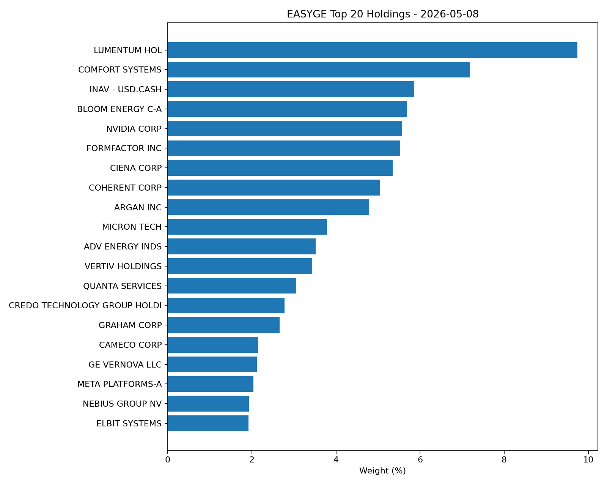
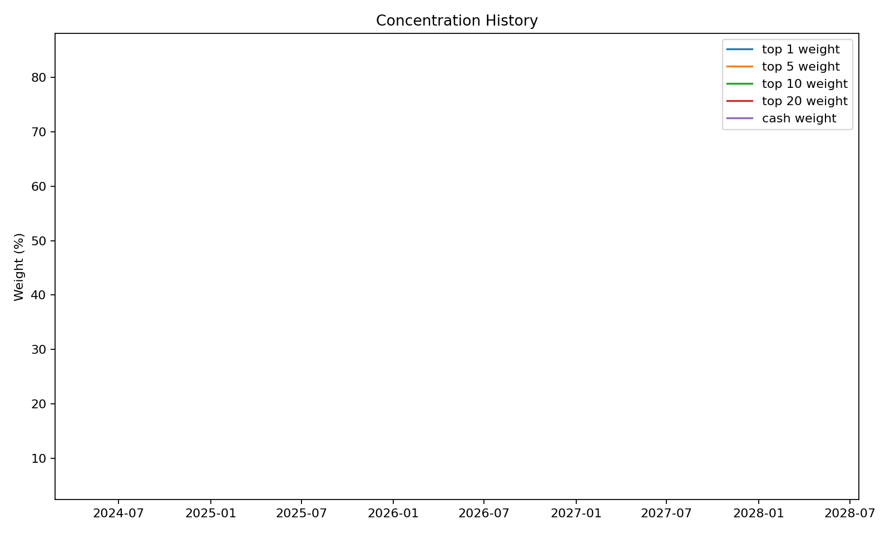
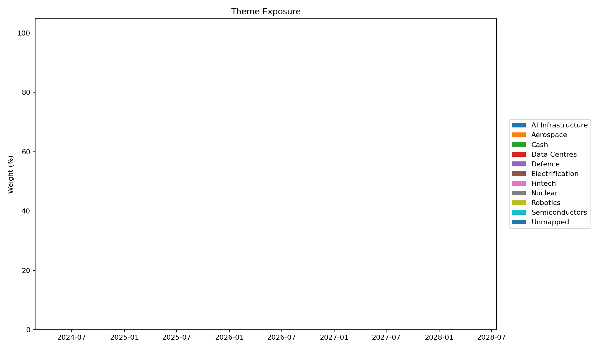

# EASYGE Active Holdings Tracker

Automated tracker for EASYGE holdings, concentration, turnover, and active-management signals.

Dashboard: (configure GitHub Pages URL)

Latest snapshot: 2026-05-08

## Summary

| Metric | Value |
|---|---:|
| Holdings | 33 |
| Cash | 6.37% |
| Top 1 weight | 9.74% |
| Top 5 weight | 34.03% |
| Top 10 weight | 58.54% |
| Top 20 weight | 84.16% |
| Estimated turnover | n/a |

## Latest Top 20 Holdings

## Concentration

## Theme Exposure

## Latest Full Holdings

| Instrument | Currency | Weight |
|---|---:|---:|
| LUMENTUM HOL | USD | 9.74% |
| COMFORT SYSTEMS | USD | 7.18% |
| INAV - USD.CASH | USD | 5.86% |
| BLOOM ENERGY C-A | USD | 5.68% |
| NVIDIA CORP | USD | 5.57% |
| FORMFACTOR INC | USD | 5.53% |
| CIENA CORP | USD | 5.35% |
| COHERENT CORP | USD | 5.05% |
| ARGAN INC | USD | 4.79% |
| MICRON TECH | USD | 3.79% |
| ADV ENERGY INDS | USD | 3.52% |
| VERTIV HOLDINGS | USD | 3.44% |
| QUANTA SERVICES | USD | 3.06% |
| CREDO TECHNOLOGY GROUP HOLDI | USD | 2.78% |
| GRAHAM CORP | USD | 2.66% |
| CAMECO CORP | USD | 2.15% |
| GE VERNOVA LLC | USD | 2.12% |
| META PLATFORMS-A | USD | 2.04% |
| NEBIUS GROUP NV | USD | 1.93% |
| ELBIT SYSTEMS | USD | 1.92% |
| NLIGHT INC | USD | 1.84% |
| GENERAL ELECTRIC | USD | 1.82% |
| CARPENTER TECH | USD | 1.70% |
| ALLEGHENY TECH | USD | 1.69% |
| Howmet Aerospace Inc | USD | 1.59% |
| APPLOVIN CO-CL A | USD | 1.29% |
| INTERACTIVE BROK | USD | 1.22% |
| KARMAN HOLDINGS INC | USD | 1.10% |
| ROBINHOOD MARK-A | USD | 0.88% |
| BWX TECHNOLOGIES | USD | 0.88% |
| KRATOS DEFENSE & | USD | 0.59% |
| KRAKEN ROBOTICS INC | USD | 0.55% |
| INAV - ZAR.CASH | ZAR | 0.51% |
